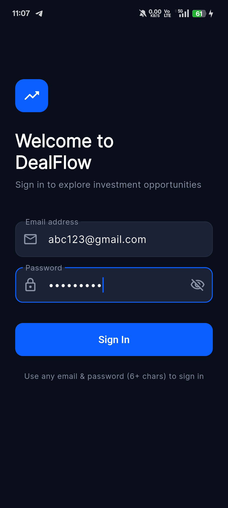
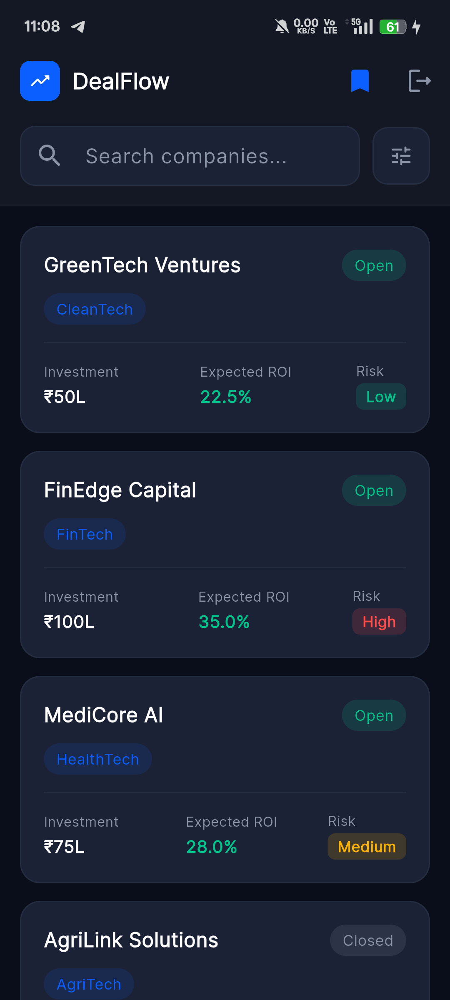
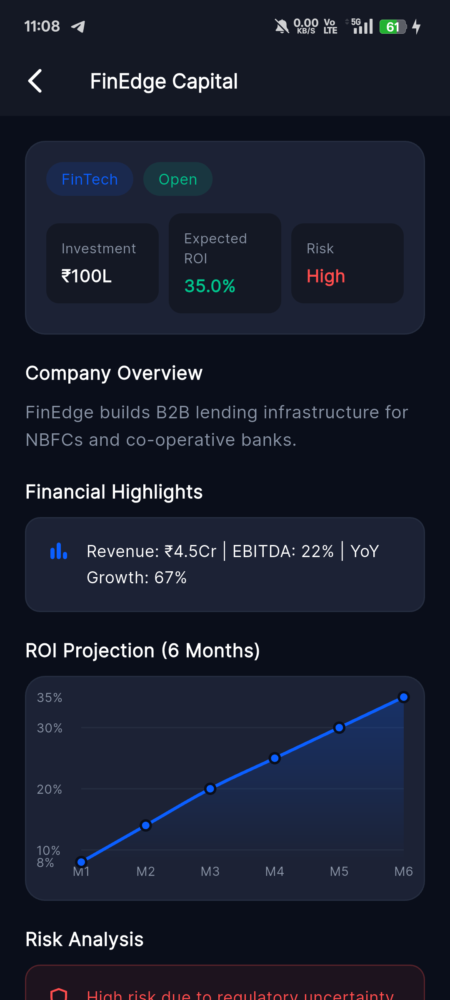
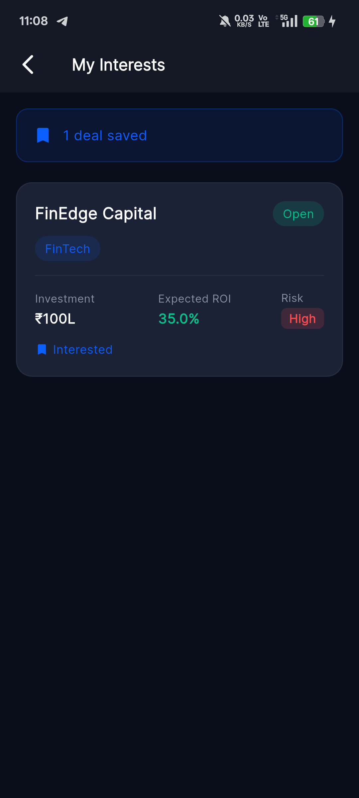

# DealFlow — Investor Deal Management App

A Flutter application where corporates post investment opportunities and investors can browse, filter, and show interest.

---

## Screenshots

> Add screenshots after building — place them in a `/screenshots` folder in your repo.

| Login | Deal Listing | Deal Detail | My Interests |
|---|---|---|---|
|  |  |  |  |

---

## Architecture

The app follows **Clean Architecture** with three clearly separated layers.

```
lib/
├── data/                          # Data layer
│   ├── models/
│   │   └── deal_model.dart        # Deal entity
│   └── repositories/
│       └── deal_repository.dart   # Mock API with simulated delay
│
├── logic/                         # Business logic layer (BLoC)
│   ├── auth/
│   │   ├── auth_bloc.dart
│   │   ├── auth_event.dart
│   │   └── auth_state.dart
│   ├── deals/
│   │   ├── deals_bloc.dart
│   │   ├── deals_event.dart
│   │   └── deals_state.dart
│   └── interests/
│       ├── interests_bloc.dart
│       ├── interests_event.dart
│       └── interests_state.dart
│
├── presentation/                  # UI layer
│   ├── screens/
│   │   ├── login_screen.dart
│   │   ├── deal_list_screen.dart
│   │   ├── deal_detail_screen.dart
│   │   └── my_interests_screen.dart
│   ├── widgets/
│   │   ├── deal_card.dart
│   │   ├── filter_sheet.dart
│   │   └── roi_chart.dart
│   ├── theme/
│   │   └── app_theme.dart
│   └── utils/
│       └── transitions.dart
│
└── main.dart
```

### Layer responsibilities

**Data layer** — defines models and provides data through a repository. The `DealRepository` returns mock data after a simulated 2-second network delay. Swapping this for a real HTTP call requires changes only here — zero changes to BLoC or UI.

**Logic layer (BLoC)** — handles all business logic. No Flutter or UI imports exist here. Each BLoC manages a single responsibility:

| BLoC | Responsibility |
|---|---|
| `AuthBloc` | Login, logout, session persistence |
| `DealsBloc` | Fetching, searching, and filtering deals |
| `InterestsBloc` | Toggling and persisting interested deals |

**Presentation layer** — screens and widgets consume BLoC states and dispatch events. No business logic lives here.

---

## Key Decisions

**Why BLoC?**
BLoC enforces a strict unidirectional data flow with explicit events and states. For an app with multiple interdependent screens — search, filters, interests — this structure scales cleanly and makes every state transition easy to trace and test.

**Why keep `allDeals` and `filteredDeals` separate in `DealsLoaded`?**
Filtering is always applied on `allDeals`, never on a previously filtered subset. This means clearing a filter correctly restores all results without re-fetching from the repository, making the filter logic reliable regardless of the order operations happen in.

**Why SharedPreferences over Hive or SQLite?**
The persistence needs are simple — a boolean session flag and a list of deal IDs. SharedPreferences is lightweight, requires no schema setup, and is sufficient for this scope. Hive would be the natural upgrade if full deal objects needed to be cached locally.

**Why mock data in Dart rather than a JSON file?**
Dart-based mock data is strongly typed and easier to refactor alongside the model. The repository interface is the same either way — switching to a JSON asset or a live API requires only changes inside `DealRepository`.

**Page transitions**
Custom `PageRouteBuilder` transitions replace the default `MaterialPageRoute`. Deal cards slide up with a fade (sheet-like feel), while navigation to My Interests slides in from the right (standard push feel). This is handled in `utils/transitions.dart` keeping all transition logic in one place.

---

## Features

**Authentication**
- Mock email and password login — any valid email with a 6+ character password works
- Session persisted via SharedPreferences — user stays logged in across app restarts
- Logout clears the session and returns to the login screen

**Deal listing**
- Cards showing company name, industry tag, investment amount, expected ROI, risk level, and status
- Real-time search by company name
- Filter sheet with industry chips, risk level selector, and ROI range slider
- Active filter indicator on the filter button
- Loading, error, and empty states all handled

**Deal details**
- Company overview and financial highlights
- 6-month ROI projection line chart with gradient fill using `fl_chart`
- Risk analysis card color-coded by risk level (green / amber / red)
- Animated "I'm Interested" button with smooth toggle between states

**My Interests**
- Lists all saved deals with a count summary banner
- Swipe to dismiss or tap Remove to delete an interest
- Persisted across sessions via SharedPreferences

---

## Dependencies

| Package | Version | Purpose |
|---|---|---|
| `flutter_bloc` | ^8.1.4 | BLoC state management |
| `equatable` | ^2.0.5 | Value equality for states |
| `shared_preferences` | ^2.2.2 | Local session and interest persistence |
| `fl_chart` | ^0.66.2 | ROI projection line chart |
| `google_fonts` | ^6.1.0 | Inter typeface |
| `iconsax` | ^0.0.8 | Fintech-style icon set |

---

## Getting Started

**Prerequisites:** Flutter SDK 3.0+, Dart 3.0+

```bash
git clone https://github.com/your-username/dealflow.git
cd dealflow
flutter pub get
flutter run
```

**Build APK:**
```bash
flutter build apk --release
```

APK is generated at `build/app/outputs/flutter-apk/app-release.apk`

---

## Author

**Your Name**
[GitHub](https://github.com/your-username) · [LinkedIn](https://linkedin.com/in/your-profile)